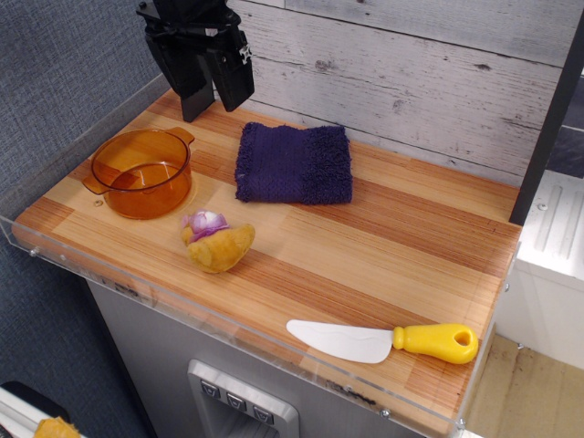
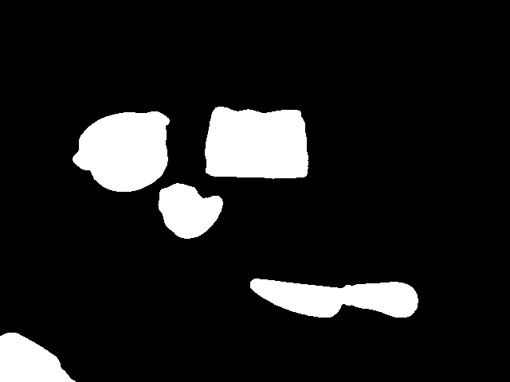
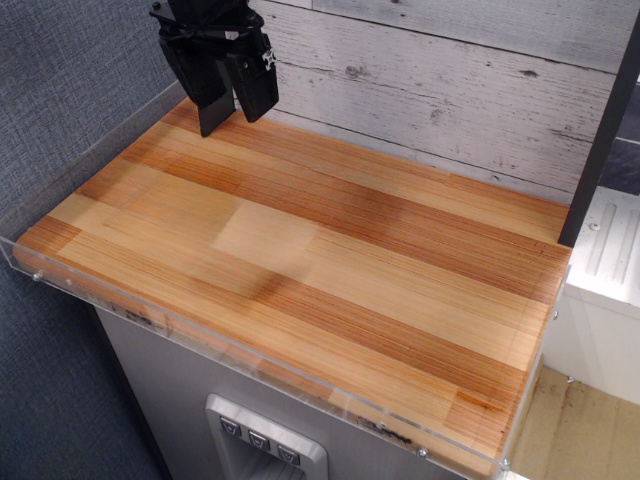

# Grounded Segment Inpaint

基于文本提示自动检测、分割并移除图像中的物体，生成干净的背景图像。

**核心功能：**
- 使用 **Grounding DINO** 根据文本提示检测物体
- 使用 **SAM/SAM2** 生成精确的分割 mask
- 使用 **iopaint (LaMa)** 移除物体并补全背景
- 支持 **迭代式 mask 扩展**：自动发现被遮挡物体的隐藏部分

## 目录

- [安装](#安装)
- [快速开始](#快速开始)
- [CLI 参数](#cli-参数)
- [配置文件](#配置文件)
- [输出结构](#输出结构)
- [Pipeline 流程](#pipeline-流程)
- [模型选择](#模型选择)
- [常见问题](#常见问题)

## 安装

### 环境要求

- Python 3.10 - 3.11
- CUDA 12.x（推荐）或 CPU
- 约 8GB 显存（使用默认模型）

### 使用 uv 安装（推荐）

```bash
cd /path/to/grounded-segment-inpaint

# 1. 创建虚拟环境
uv venv --python 3.11 .venv
source .venv/bin/activate

# 2. 安装 PyTorch（根据你的 CUDA 版本调整）
uv pip install torch torchvision --index-url https://download.pytorch.org/whl/cu128

# 3. 安装主要依赖
uv pip install --index-strategy unsafe-best-match \
    "transformers>=4.36.0" \
    "iopaint>=1.2.0" \
    "numpy<2.0" \
    "opencv-python>=4.8.0" \
    "pyyaml>=6.0" \
    "requests>=2.31.0" \
    "tqdm>=4.66.0"

# 4. 安装 SAM2
uv pip install --index-strategy unsafe-best-match \
    "git+https://github.com/facebookresearch/sam2.git"

# 5. （可选）安装 SAM1 作为备选
uv pip install --index-strategy unsafe-best-match \
    "git+https://github.com/facebookresearch/segment-anything.git"
```

### 使用 pip 安装

```bash
pip install torch torchvision
pip install transformers iopaint numpy opencv-python pyyaml requests tqdm
pip install git+https://github.com/facebookresearch/sam2.git
pip install git+https://github.com/facebookresearch/segment-anything.git  # 可选
```

或者使用 requirements.txt：

```bash
pip install -r requirements.txt
pip install git+https://github.com/facebookresearch/sam2.git
```

### 验证安装

```bash
python -c "
import torch; print(f'PyTorch: {torch.__version__}, CUDA: {torch.cuda.is_available()}')
import transformers; print(f'Transformers: {transformers.__version__}')
import sam2; print('SAM2: OK')
import iopaint; print('iopaint: OK')
"
```

## 快速开始

### 基本用法

```bash
# 使用配置文件
python main.py --image photo.jpg --config configs/items.yml

# 指定输出目录
python main.py --image photo.jpg --config configs/items.yml --output-dir outputs/demo_run

# 使用命令行指定 prompts（覆盖配置文件）
python main.py --image photo.jpg --prompts "cup" "knife" "robot arm"

# 只分割不补全背景
python main.py --image photo.jpg --prompts "cup" --no-inpaint

# 保存调试信息
python main.py --image photo.jpg --save-debug

# 强制输出尺寸（默认 448x448）
python main.py --image photo.jpg --prompts "cup" --resize-output

# 指定输出尺寸
python main.py --image photo.jpg --prompts "cup" --resize-output 640x480
```

**配置说明：** 不指定 `--config` 时不会自动加载 `configs/items.yml`，需要通过 `--prompts` 提供检测提示词。

### 示例输出

```
==================================================
Configuration:
  Image: photo.jpg
  Output: outputs/20240119_223000
  DINO Model: grounding-dino-tiny
  SAM Model: sam2_hiera_small
  Prompts: ['robot arm', 'pot', 'knife', 'towel']
  Box Threshold: 0.3
  Text Threshold: 0.3
  IoU Threshold: 0.5
  Inpaint: iopaint
  Save Debug: False
==================================================
Detecting objects...
  'robot arm': found 1 objects
  'pot': found 1 objects
  'knife': found 1 objects
  'towel': found 1 objects
Total detections: 4
Segmenting objects with SAM...
Segmented 4 objects
Deduplicating with IoU threshold 0.5...
After deduplication: 4 unique objects
Inpainting background with iopaint...
  Iterative inpaint + re-detection for 4 objects...
    [1/4] Checking expansion after removing 'robot arm'...
        Expanding 'towel': +1500 pixels
    ...
Background inpainting complete.

==================================================
Summary:
  Detections: 4
  Unique Objects: 4
    - ['robot arm'] (area: 23862, score: 0.496)
    - ['pot'] (area: 13457, score: 0.440)
    - ['knife'] (area: 3423, score: 0.603)
    - ['towel'] (area: 10638, score: 0.571)
  Output Directory: outputs/20240119_223000
==================================================
```

### 示例结果（test4）

以下结果来自 `outputs/test4`，图片已拷贝到 `assets/` 便于展示。

原图：


合并 mask：


清理后的背景：


## CLI 参数

| 参数 | 类型 | 默认值 | 说明 |
|------|------|--------|------|
| `--image`, `-i` | str | **必填** | 输入图片路径 |
| `--output-dir`, `-o` | str | `outputs/<timestamp>` | 输出目录 |
| `--config`, `-c` | str | 无 | YAML 配置文件路径 |
| `--prompts`, `-p` | list | - | 检测提示词列表（覆盖配置文件） |
| `--dino-model` | str | `grounding-dino-tiny` | Grounding DINO 模型 |
| `--sam-model` | str | `sam2_hiera_small` | SAM 模型 |
| `--device` | str | `cuda` | 运行设备 |
| `--box-threshold` | float | `0.25` | 检测框置信度阈值 |
| `--text-threshold` | float | `0.25` | 文本匹配阈值 |
| `--iou-threshold` | float | `0.5` | Mask 去重 IoU 阈值 |
| `--inpaint-backend` | str | `iopaint` | 补全后端: `iopaint`/`opencv`/`none` |
| `--no-inpaint` | flag | - | 跳过背景补全 |
| `--save-debug` | flag | - | 保存调试产物 |
| `--resize-output` | str | 关闭 | 强制缩放所有输出图片；不带值时默认 `448x448` |

**注意：**
- CLI 参数会覆盖配置文件中的对应设置
- 只有显式指定 `--config` 时才会读取配置文件；否则使用代码内置默认值
- 例如：`items.yml` 使用 `box_threshold: 0.30`，所以如果加载该配置文件，实际阈值会是 0.30 而非 0.25

## 配置文件

配置文件使用 YAML 格式。

**配置文件：**
- `configs/items.yml` - 默认配置，包含常用物体的 prompts

示例config：

```yaml
# 检测提示词列表
# 提示：将常遮挡其他物体的放在前面（如 robot arm）
prompts:
  # ========== Robot & Equipment ==========
  - "robot arm"
  - "gripper"

  # ========== Kitchen Utensils ==========
  - "pot"
  - "knife"
  - "cup"
  - "plate"

  # ========== Food Items ==========
  - "bread"
  - "apple"
  - "onion"

  # ========== Cleaning & Fabric ==========
  - "towel"
  - "rag"
  - "cloth"

settings:
  # 检测阈值（越高越严格，减少误检）
  box_threshold: 0.30
  text_threshold: 0.30

  # Mask 去重阈值
  iou_threshold: 0.5

  # 模型选择
  sam_model: sam2_hiera_small          # 或 vit_h (SAM1)
  grounding_dino_model: grounding-dino-tiny  # 或 grounding-dino-base

  # 背景补全
  inpaint_backend: iopaint             # iopaint / opencv / none
  mask_dilate_pixels: 12               # Mask 膨胀像素数

  # 调试
  save_debug: false

  # 输出尺寸（可选），格式：[宽, 高]
  output_size: [448, 448]

  # 设备
  device: cuda
```

补充说明：
- `output_size` 不设置则保持原始尺寸；设置后所有保存的图片都会被强制缩放。

### Prompt 顺序的重要性

**将常遮挡其他物体的 prompt 放在前面**（如 `robot arm`）。

原因：Pipeline 按顺序处理物体，先移除的物体会暴露被遮挡的区域，使得后续物体的 mask 能够被正确扩展。

## 输出结构

```
outputs/<timestamp>/
├── input_image.png          # 输入图像副本
├── detections.json          # 所有检测结果
├── combined_mask.png        # 合并的二值 mask
├── clean_background.png     # 移除物体后的干净背景
├── report.json              # 处理报告
├── objects/                 # 各物体的单独输出
│   ├── 000_robot_arm/
│   │   ├── mask.png         # 二值 mask（白色物体，黑色背景）
│   │   ├── mask_rgb.png     # RGB mask（原图颜色，黑色背景）
│   │   └── info.json        # 物体信息
│   ├── 001_pot/
│   │   └── ...
│   └── ...
└── debug/                   # 仅在 save_debug=true 时生成
    ├── step_01_remove_robot_arm/
    │   ├── removed_mask.png
    │   ├── removed_mask_rgb.png
    │   ├── inpainted.png    # 移除该物体后的图像
    │   └── redetected/      # 重新检测到的 masks
    ├── step_02_remove_pot/
    │   └── ...
    └── final_expanded_masks/  # 最终扩展后的 masks
```

## Pipeline 流程

```
┌─────────────────────────────────────────────────────────────────┐
│                        输入图像                                  │
└─────────────────────────────────────────────────────────────────┘
                              │
                              ▼
┌─────────────────────────────────────────────────────────────────┐
│  Step 1: 初始检测                                                │
│  - Grounding DINO 根据每个 prompt 检测物体                       │
│  - SAM 为每个检测框生成精确 mask                                 │
│  - 根据 IoU 去重（合并重叠的 mask）                              │
└─────────────────────────────────────────────────────────────────┘
                              │
                              ▼
┌─────────────────────────────────────────────────────────────────┐
│  Step 2: 迭代式 Mask 扩展                                        │
│  对于每个物体：                                                   │
│  1. 从当前图像移除该物体（膨胀 mask + inpaint）                  │
│  2. 在移除后的图像上重新检测（只检测已知标签）                   │
│  3. 如果检测到的 mask 与其他物体的原 mask 相邻且同类型：         │
│     → 扩展该物体的 mask（限制：不超过原面积的 3 倍）             │
│  4. 更新当前图像，处理下一个物体                                 │
└─────────────────────────────────────────────────────────────────┘
                              │
                              ▼
┌─────────────────────────────────────────────────────────────────┐
│  Step 3: 最终补全                                                │
│  - 使用扩展后的 masks 顺序补全背景                               │
│  - 输出干净的背景图像                                            │
└─────────────────────────────────────────────────────────────────┘
```

### 为什么需要迭代式 Mask 扩展？

当物体 A 遮挡物体 B 的一部分时：
1. 初始检测只能检测到 B 的可见部分
2. 移除 A 后，B 被遮挡的部分暴露出来
3. 重新检测可以发现 B 的完整范围
4. 扩展 B 的 mask，确保完全移除

**示例：** 机械臂遮挡毛巾的一部分
- 初始：毛巾 mask 不完整（有缺口）
- 移除机械臂后：重新检测发现毛巾的完整形状
- 扩展：毛巾 mask 被补全
- 最终：毛巾被完全移除，无残留

## 模型选择

### Grounding DINO

| 模型 | 说明 | 推荐场景 |
|------|------|----------|
| `grounding-dino-tiny` | 更快，显存占用少 | 默认选择 |
| `grounding-dino-base` | 更准确，但更慢 | 复杂场景或检测效果不佳时 |

### SAM

| 模型 | 参数量 | 说明 |
|------|--------|------|
| `sam2_hiera_tiny` | - | 最快 |
| `sam2_hiera_small` | - | 平衡（默认） |
| `sam2_hiera_base_plus` | - | 更准确 |
| `sam2_hiera_large` | - | 最准确 |
| `vit_b` | 91M | SAM1，快速 |
| `vit_l` | 308M | SAM1，平衡 |
| `vit_h` | 636M | SAM1，高精度 |

**显存参考（RTX 3050 8GB）：**
- `grounding-dino-tiny` + `sam2_hiera_small`：约 6GB
- `grounding-dino-base` + `sam2_hiera_large`：可能 OOM

## 常见问题

### 1. 物体没有被完全移除，有残留

**可能原因：**
- 检测阈值过高，部分区域未被检测到
- 被遮挡的部分未能通过迭代扩展发现

**解决方案：**
- 降低阈值：`--box-threshold 0.2 --text-threshold 0.2`
- 使用更大的模型：`--dino-model grounding-dino-base`
- 调整 prompt 顺序：将遮挡物放前面
- 使用 `--save-debug` 检查中间结果

### 2. 误检测了不想要的物体

**解决方案：**
- 提高阈值：`--box-threshold 0.5 --text-threshold 0.5`
- 使用更精确的 prompt：`"yellow knife"` 而不是 `"knife"`
- 减少 prompt 数量

### 3. 显存不足 (OOM)

**解决方案：**
- 使用更小的模型：`--sam-model sam2_hiera_tiny`
- 使用 CPU：`--device cpu`（会很慢）
- 缩小输入图像尺寸

### 4. 补全效果不理想

**说明：** iopaint (LaMa) 在复杂纹理或大面积补全时可能效果有限。

**建议：**
- 确保 mask 膨胀足够（默认 12px）
- 对于大面积物体，考虑使用其他专业修图工具

## 致谢

本项目使用了以下开源项目：
- [Grounding DINO](https://github.com/IDEA-Research/GroundingDINO) - 开放词汇目标检测
- [SAM2](https://github.com/facebookresearch/sam2) - Segment Anything Model 2
- [iopaint](https://github.com/Sanster/IOPaint) - 图像修复工具

## License

MIT License
