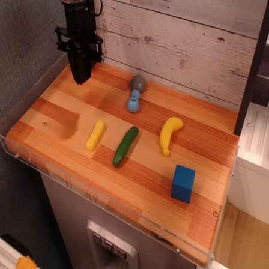
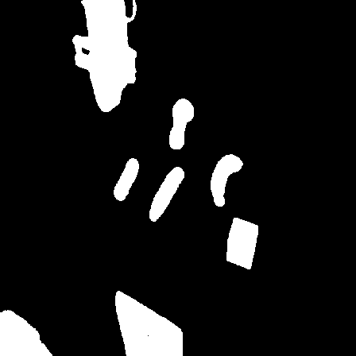
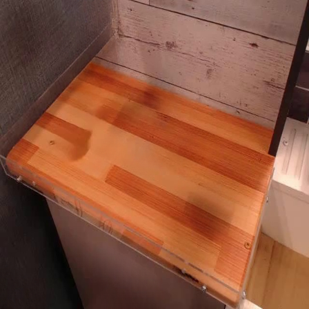
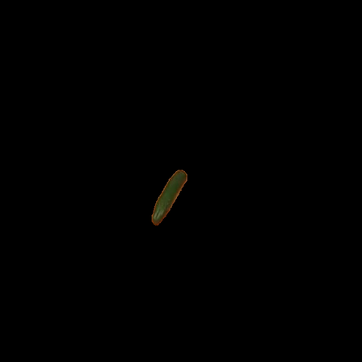
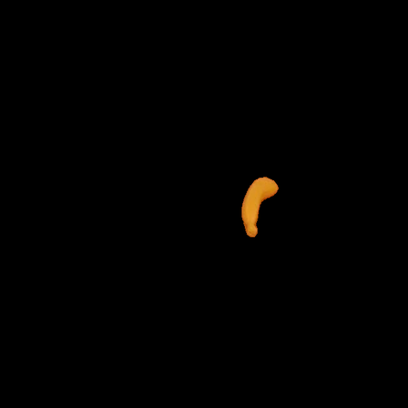
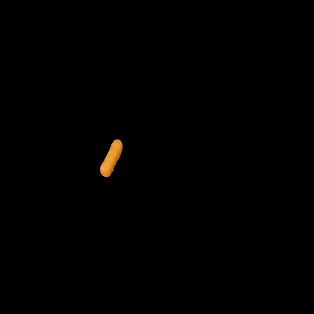
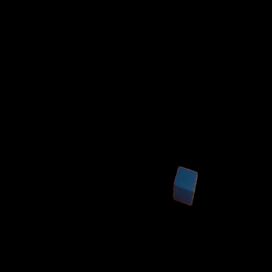
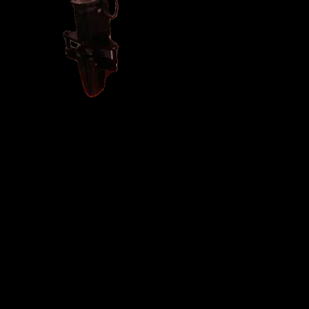
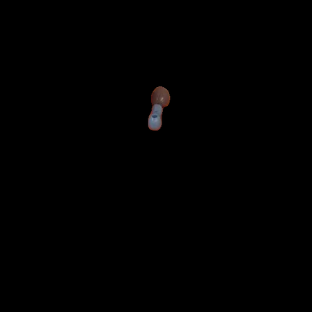

# Prompt-Inpaint

基于文本提示自动检测、分割并移除图像中的物体，生成干净的背景图像。

**核心功能：**
- 使用 **SAM 3**（Meta 的 Segment Anything 3)单步从文本 prompt 直接产出 mask + box + score,取代过去的 Grounding DINO + SAM2 两阶段流水线
- 使用 **iopaint (LaMa)** 移除物体并补全背景
- 支持 **迭代式 mask 扩展**:自动发现被遮挡物体的隐藏部分

## 目录

- [安装](#安装)
- [快速开始](#快速开始)
- [CLI 参数](#cli-参数)
- [配置文件](#配置文件)
- [Pipeline 流程](#pipeline-流程)
- [批处理脚本](#批处理脚本)
- [模型选择](#模型选择)
- [常见问题](#常见问题)

## 安装

### 环境要求

- Python 3.10 - 3.11
- CUDA 12.x（推荐）或 CPU
- 约 8GB 显存（使用默认模型）

### 使用 uv 安装(推荐)

```bash
cd /path/to/grounded-segment-inpaint

# 1. 创建虚拟环境
uv venv --python 3.11 .venv
source .venv/bin/activate

# 2. 安装 PyTorch(根据你的 CUDA 版本调整)
uv pip install "torch>=2.7" "torchvision>=0.22" --index-url https://download.pytorch.org/whl/cu128

# 3. 安装 SAM3 + 其它依赖
uv pip install --index-strategy unsafe-best-match \
    "sam3 @ git+https://github.com/facebookresearch/sam3.git" \
    einops huggingface_hub \
    "iopaint>=1.2.0" \
    "numpy<2.0" "opencv-python>=4.8.0" "pyyaml>=6.0" "requests>=2.31.0" "tqdm>=4.66.0" setuptools
```

### 使用 pip 安装

```bash
pip install "torch>=2.7" "torchvision>=0.22" --index-url https://download.pytorch.org/whl/cu128
pip install -r requirements.txt
```

### 申请 HuggingFace 权限并登录(下载 SAM3 权重必需)

`facebook/sam3` 是 gated 模型,需要先在
[模型页面](https://huggingface.co/facebook/sam3) 申请访问权,然后本地登录一次:

```bash
huggingface-cli login
```

首次运行会下载 SAM3 权重(~3.4GB)并缓存到 `~/.cache/huggingface/hub`。
若 `<repo>/checkpoints/sam3.pt` 已存在则优先使用本地文件。

### 验证安装

```bash
python -c "
import torch; print(f'PyTorch: {torch.__version__}, CUDA: {torch.cuda.is_available()}')
from sam3.model_builder import build_sam3_image_model; print('SAM3: OK')
import iopaint; print('iopaint: OK')
"
```

## 快速开始

### 基本用法

```bash
# 最常用指令: 打开单独保存mask + 强制输出尺寸448x448
python main.py --image photo.jpg --resize-output --save-individual-masks --config configs/items.yml

# 保存透明抠图（RGBA，裁剪到物体大小）
python main.py --image photo.jpg --save-individual-transparent-masks --no-inpaint

# 使用特定配置文件
python main.py --image photo.jpg --config configs/items.yml

# 指定输出目录
python main.py --image photo.jpg --output-dir outputs/demo_run

# 使用命令行指定 prompts（覆盖配置文件）
python main.py --image photo.jpg --prompts "cup" "knife" "robot arm"

# 只分割不补全背景
python main.py --image photo.jpg --prompts "cup" --no-inpaint

# 保存调试信息
python main.py --image photo.jpg --save-debug

# 强制输出尺寸（默认 448x448）
python main.py --image photo.jpg --prompts "cup" --resize-output

# 指定输出尺寸
python main.py --image photo.jpg --prompts "cup" --resize-output 640x480
```

**配置说明：** 不指定 `--config` 时会自动加载 `configs/items.yml`（如果存在）；若默认配置不存在，则需要通过 `--prompts` 提供检测提示词。

### 示例结果（Sample）

原图：



合并 mask：



清理后的背景：



分离出的物体（RGB mask）：

| | | |
| --- | --- | --- |
| cucumber<br> | banana<br> | corn<br> |
| sponge<br> | gripper<br> | computer mouse<br> |

## CLI 参数

| 参数 | 类型 | 默认值 | 说明 |
|------|------|--------|------|
| `--image`, `-i` | str | **必填** | 输入图片路径 |
| `--output-dir`, `-o` | str | `outputs/<timestamp>` | 输出目录 |
| `--config`, `-c` | str | `configs/items.yml` | YAML 配置文件路径 |
| `--prompts`, `-p` | list | - | 检测提示词列表(覆盖配置文件) |
| `--sam3-model` | str | `facebook/sam3` | SAM3 模型 id 或本地 checkpoint 路径 |
| `--device` | str | `cuda` | 运行设备 |
| `--sam3-threshold` | float | `0.5` | SAM3 检测置信度阈值 |
| `--sam3-mask-threshold` | float | `0.5` | SAM3 mask 二值化阈值 |
| `--iou-threshold` | float | `0.5` | Mask 去重 IoU 阈值 |
| `--inpaint-backend` | str | `iopaint` | 补全后端: `iopaint`/`opencv`/`none` |
| `--mask-dilate-pixels` | int | `12` | Mask 膨胀像素数（用于补全） |
| `--no-inpaint` | flag | - | 跳过背景补全 |
| `--save-debug` | flag | - | 保存调试产物 |
| `--save-individual-masks [0\|1]` | int? | - | 保存单独的 RGB masks（黑底）；默认不保存 `robot arm`/`gripper`，传 `1` 则包含 |
| `--save-individual-transparent-masks [0\|1]` | int? | - | 保存单独的透明抠图（RGBA，裁剪到物体大小）；默认不保存 `robot arm`/`gripper`，传 `1` 则包含 |
| `--resize-output` | str | 关闭 | 强制缩放所有输出图片；不带值时默认 `448x448` |

**注意：**
- CLI 参数会覆盖配置文件中的对应设置
- 未指定 `--config` 时会尝试加载默认配置 `configs/items.yml`；若不存在则使用代码内置默认值
- 例如:`items.yml` 设置 `sam3_threshold: 0.6`,所以如果加载该配置文件,实际阈值是 0.6 而非默认 0.5
- `--save-individual-masks` 和 `--save-individual-transparent-masks` 可同时开启：开哪个就保存哪个，都开则同时保存，都不开发则不保存

## 配置文件

配置文件使用 YAML 格式。

**配置文件：**
- `configs/items.yml` - 默认配置，包含常用物体的 prompts

示例config：

```yaml
# 检测提示词列表
# 提示：将常遮挡其他物体的放在前面（如 robot arm）
prompts:
  # ========== Robot & Equipment ==========
  - "robot arm"
  - "gripper"

  # ========== Kitchen Utensils ==========
  - "pot"
  - "knife"
  - "cup"
  - "plate"

  # ========== Food Items ==========
  - "bread"
  - "apple"
  - "onion"

  # ========== Cleaning & Fabric ==========
  - "towel"
  - "rag"
  - "cloth"

settings:
  # SAM3 模型:HuggingFace id 或本地 checkpoint 路径
  sam3_model: facebook/sam3

  # SAM3 检测置信度(越高越严格,减少误检)
  sam3_threshold: 0.5

  # SAM3 mask 二值化阈值
  sam3_mask_threshold: 0.5

  # Mask 去重阈值
  iou_threshold: 0.5

  # 小 mask 包含合并阈值(覆盖比例)
  containment_overlap_ratio: 0.9

  # 轮廓重合阈值(用于区分错误拆分)
  contour_overlap_ratio: 0.3

  # 背景补全
  inpaint_backend: iopaint             # iopaint / opencv / none
  mask_dilate_pixels: 12               # Mask 膨胀像素数

  # 调试
  save_debug: false

  # 输出选项
  save_individual_masks: false   # 是否保存单独的 RGB masks 到 masks/ 文件夹
  output_size: [448, 448]        # 输出尺寸（可选），格式：[宽, 高]

  # 设备
  device: cuda
```

补充说明：
- `output_size` 不设置则保持原始尺寸；设置后所有保存的图片都会被强制缩放。
- 去重规则：IoU 超阈值直接合并；若小 mask 覆盖比例 > `containment_overlap_ratio` 且轮廓重合 > `contour_overlap_ratio`，也会合并。


## Pipeline 流程

```
┌─────────────────────────────────────────────────────────────────┐
│                        输入图像                                  │
└─────────────────────────────────────────────────────────────────┘
                              │
                              ▼
┌─────────────────────────────────────────────────────────────────┐
│  Step 1: 初始检测                                                 │
│  - SAM3 接收每个文本 prompt,单步返回 mask + box + score            │
│    (vision features 在同一张图上跨 prompt 复用)                    │
│  - 根据 IoU 去重(合并重叠的 mask)                                  │
└─────────────────────────────────────────────────────────────────┘
                              │
                              ▼
┌─────────────────────────────────────────────────────────────────┐
│  Step 2: 迭代式 Mask 扩展                                         │
│  对于每个物体：                                                   │
│  1. 从当前图像移除该物体（膨胀 mask + inpaint）                      │
│  2. 在移除后的图像上重新检测（只检测已知标签）                          │
│  3. 如果检测到的 mask 与其他物体的原 mask 相邻且同类型：               │
│     → 扩展该物体的 mask（限制：不超过原面积的 3 倍）                   │
│  4. 更新当前图像，处理下一个物体                                     │
└─────────────────────────────────────────────────────────────────┘
                              │
                              ▼
┌─────────────────────────────────────────────────────────────────┐
│  Step 3: 最终补全                                                │
│  - 使用扩展后的 masks 顺序补全背景                                  │
│  - 输出干净的背景图像                                              │
└─────────────────────────────────────────────────────────────────┘
```

### 为什么需要迭代式 Mask 扩展？

当物体 A 遮挡物体 B 的一部分时：
1. 初始检测只能检测到 B 的可见部分
2. 移除 A 后，B 被遮挡的部分暴露出来
3. 重新检测可以发现 B 的完整范围
4. 扩展 B 的 mask，确保完全移除

**示例：** 机械臂遮挡毛巾的一部分
- 初始：毛巾 mask 不完整（有缺口）
- 移除机械臂后：重新检测发现毛巾的完整形状
- 扩展：毛巾 mask 被补全
- 最终：毛巾被完全移除，无残留

## 批处理脚本

对于 Bridge V2 等数据集，可以使用批处理脚本一次性处理多个子数据集。

### 使用方法

```bash
# 基本用法
python scripts/batch_process_datasets.py \
    --input-root /path/to/traj_group0 \
    --output-dir ./batch_outputs \
    --config configs/items.yml

# 带 resize 和 individual masks（默认不保存 robot arm / gripper）
python scripts/batch_process_datasets.py \
    --input-root /path/to/traj_group0 \
    --output-dir ./batch_outputs \
    --config configs/items.yml \
    --resize-output 448x448 \
    --save-individual-masks

# 跳过补全加速处理（包含 robot arm / gripper）
python scripts/batch_process_datasets.py \
    --input-root /path/to/traj_group0 \
    --output-dir ./batch_outputs \
    --no-inpaint \
    --save-individual-masks 1
```

### 批处理参数

| 参数 | 类型 | 默认值 | 说明 |
|------|------|--------|------|
| `--input-root` | str | **必填** | 包含子数据集的根目录 |
| `--output-dir` | str | **必填** | 输出目录 |
| `--config`, `-c` | str | `configs/items.yml` | 配置文件路径 |
| `--resize-output` | str | 关闭 | 调整输出尺寸 |
| `--save-individual-masks [0\|1]` | int? | - | 保存单独的 RGB masks；默认不保存 `robot arm`/`gripper`，传 `1` 则包含 |
| `--no-inpaint` | flag | - | 跳过背景补全 |
| `--save-debug` | flag | - | 保存调试产物 |
| `--overwrite` | flag | - | 覆盖已存在的结果 |
| `--device` | str | `cuda` | 运行设备 |

### 输出结构

```
batch_outputs/
├── dataset_001/
│   ├── input_image.png
│   ├── combined_mask.png
│   ├── clean_background.png
│   ├── report.json
│   ├── objects/
│   └── masks/              # 如果启用 --save-individual-masks
├── dataset_002/
└── ...
```

**特点：**
- 模型只加载一次，批量处理时复用
- 自动跳过已处理的数据集（除非使用 `--overwrite`）
- 对每个子数据集中的第一张图片进行处理

## 模型选择

### SAM3

目前只发布了一个公开 checkpoint:`facebook/sam3`(约 0.9B 参数,3.4GB)。

**离线/本地模型:** 如果存在 `checkpoints/sam3.pt`,会优先从本地加载;否则首次运行从 Hugging Face 下载(gated,见安装说明)。

**显存参考(RTX 3090 24GB,RGB 448×448):**
- SAM3 推理:约 6–10 GB
- iopaint LaMa 背景补全:几百 MB

模型在单次前向传播中完成"Grounding DINO + SAM2"两阶段流程的等效任务 —— text prompt 直接产出 masks、boxes、scores。

## 常见问题

### 1. 物体没有被完全移除,有残留

**可能原因:**
- SAM3 置信度阈值过高,部分区域被过滤
- 被遮挡的部分未能通过迭代扩展发现

**解决方案:**
- 降低阈值:`--sam3-threshold 0.3`
- 调整 prompt 顺序:将遮挡物放前面(它会先被 inpaint 掉)
- 使用 `--save-debug` 检查中间结果

### 2. 误检测了不想要的物体

**解决方案:**
- 提高阈值:`--sam3-threshold 0.7`
- 使用更精确的 prompt:`"yellow knife"` 而不是 `"knife"`
- 减少 prompt 数量

### 3. 显存不足 (OOM)

**解决方案:**
- 使用 CPU:`--device cpu`(会非常慢)
- 缩小输入图像尺寸
- 关闭其它占显存的进程

### 4. 补全效果不理想

**说明:** iopaint (LaMa) 在复杂纹理或大面积补全时可能效果有限。

**建议:**
- 确保 mask 膨胀足够(默认 12px)
- 对于大面积物体,考虑使用其他专业修图工具

### 5. 报错:`Cannot access gated repo for facebook/sam3`

**可能原因:** 没有获得 Hugging Face 访问权限,或者本地未登录。

**解决方案:**
1. 访问 https://huggingface.co/facebook/sam3 并申请 access
2. 运行 `huggingface-cli login` 并粘贴 read token

## 致谢

本项目使用了以下开源项目:
- [SAM 3](https://huggingface.co/facebook/sam3) - Meta 的 Segment Anything 3
- [iopaint](https://github.com/Sanster/IOPaint) - 图像修复工具

## License

MIT License
